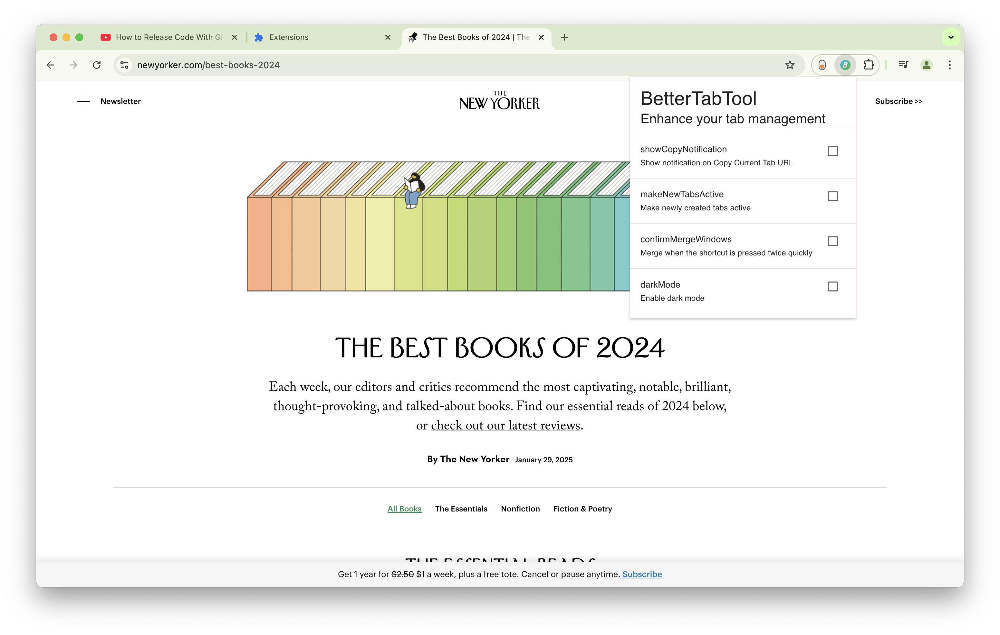
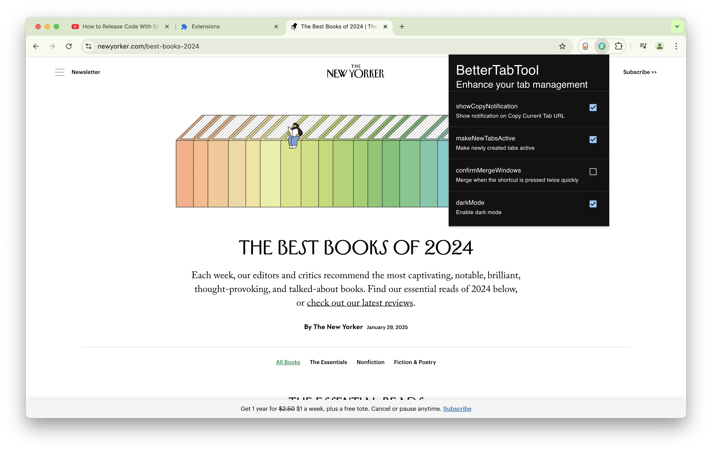
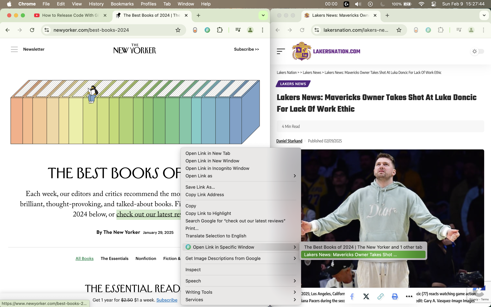
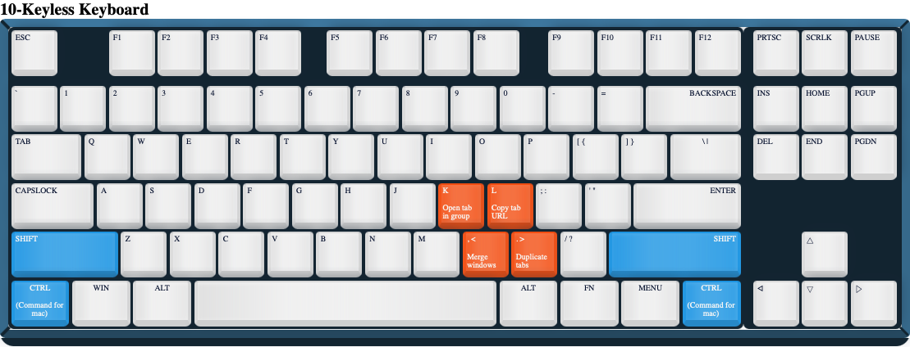

# BetterTabTool

## Setup Instructions

-   Clone the repo
-   Run `npm run build` from the repo
    -   This generates extension files in `./dist/`
-   Open Chrome and navigate to `chrome://extensions`
-   Turn on developer mode toggle (top right corner)
-   Click "Load unpacked" and select the dist folder that was just generated

## Development Instructions

-   Complete setup above and ensure the extension is loaded
-   Make some changes...
-   Run `npm run build` from the repo
-   Open Chrome and navigate to `chrome://extensions`
-   Either add the extension through "Load unpacked" or click the reload button on the existing extension

## Screenshots

Light mode popup

Dark mode popup

Open link in Specific Window

### Default Keybinds

